# TrailNest — Tour & Travel Booking Website

A full front-end website for a tour & travel agency: marketing site, blog with a lightweight CMS, contact system, and a package-booking pipeline — all built as static HTML/CSS/JS with a browser-storage backend. Includes a light/dark mode toggle.

> ⚠️ **"TrailNest" is a placeholder brand name.** Swap it for your real brand name across all files before launch (see [Customizing](#customizing) below).

---

## 🚨 READ THIS FIRST — why "nothing submits or shows up"

If you open these files by **double-clicking `index.html`** (so the address bar shows `file:///...`), some browsers treat **every single file as its own separate storage space**. That means:

- A blog post published on `admin.html` won't appear on `blog.html`
- A message sent from `contact.html` won't appear on `admin-contact.html`
- A booking request from `index.html` won't appear on `admin-bookings.html`

This isn't a bug in the code — it's a browser security rule for `file://` pages. **The fix takes 10 seconds:**

```bash
# from inside the site folder, pick ONE:
python3 -m http.server 8000
# or
npx serve .
```

Then open `http://localhost:8000` instead of double-clicking the file. Every page will now share the same storage, and publishing/submitting will work exactly as expected. The site itself will show an orange banner at the top if it detects you're using `file://`, as a reminder.

---

## 📸 Screenshots

### Home page

**Hero** — animated plane, real featured-trip photo, live stats
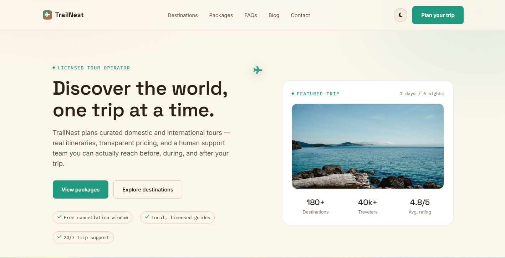

**Live trip availability**
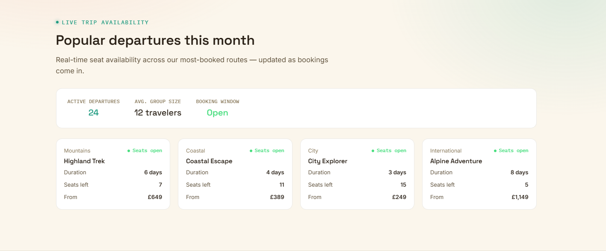

**Why TrailNest**
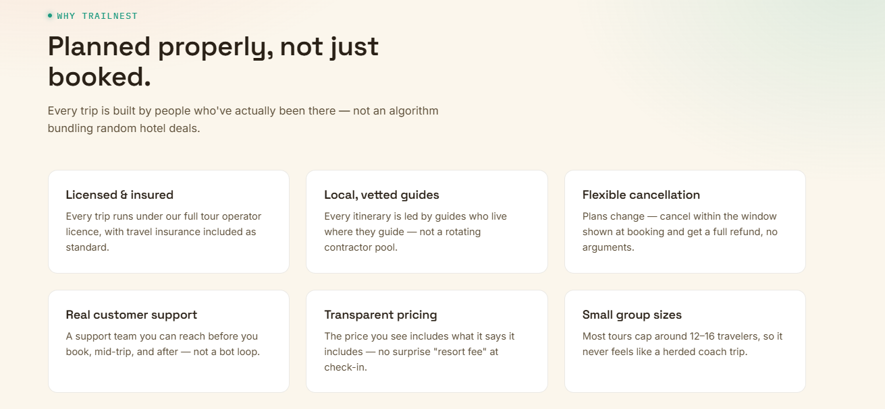

**Booking separately vs. booking with us**
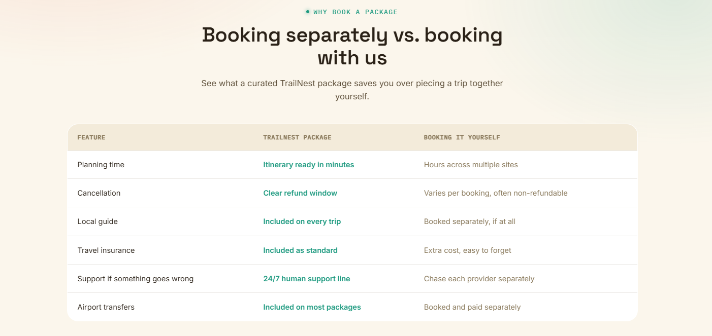

**Packages**
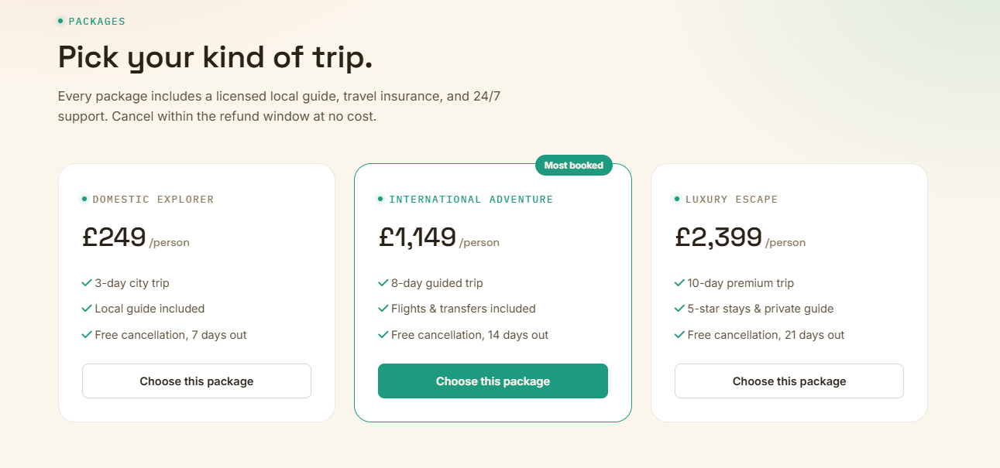

**FAQ accordion**
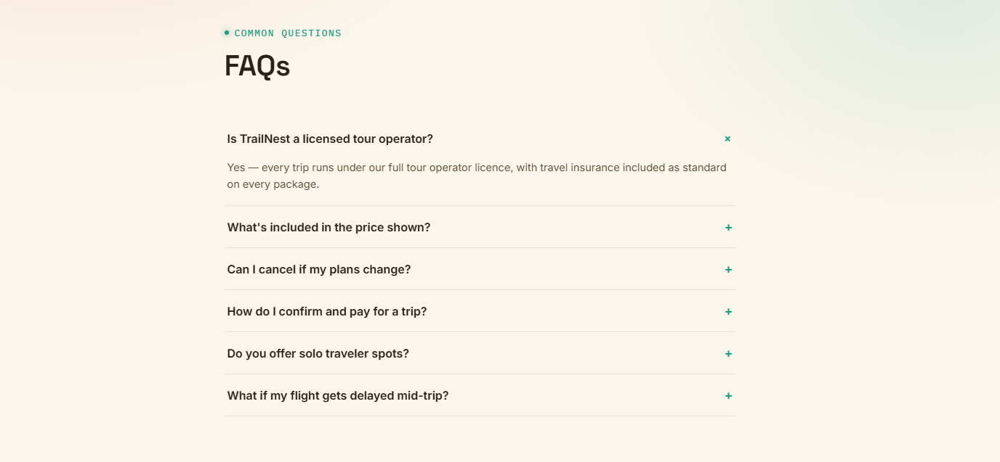

**Footer**
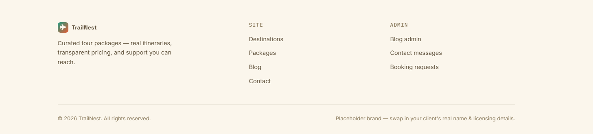

**Dark mode**
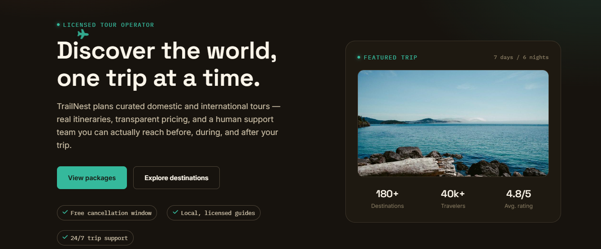

### Blog
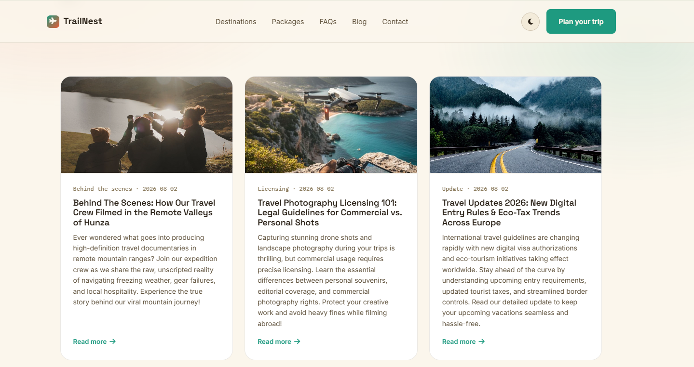

### Contact page
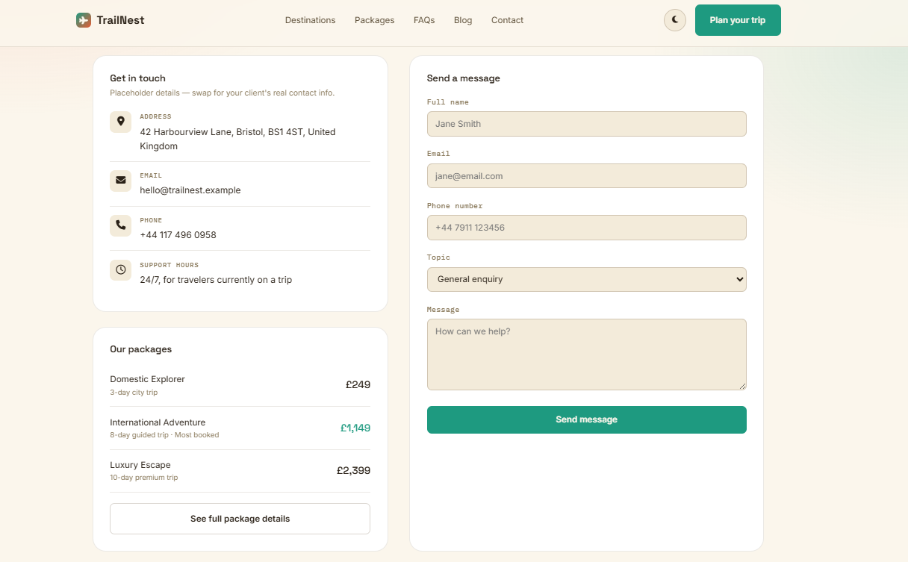

### Admin panel
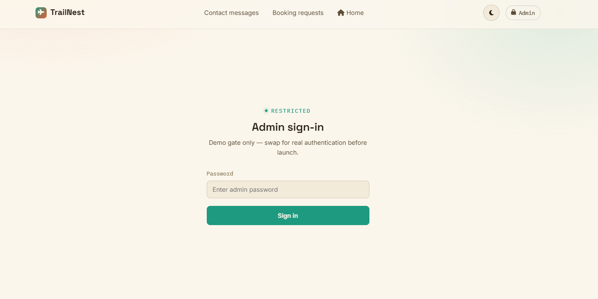
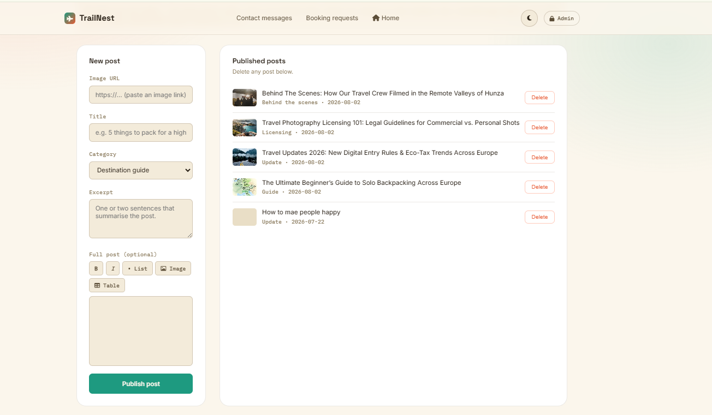
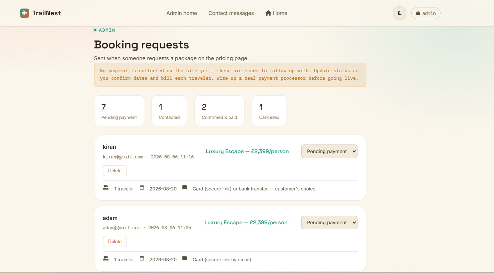
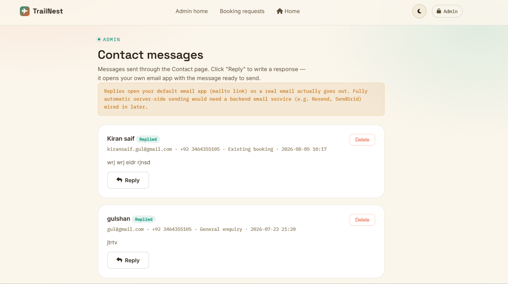
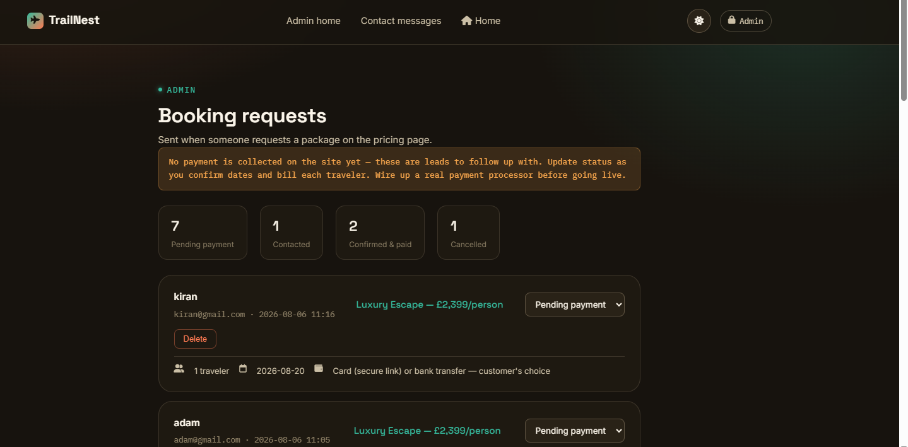

### Mobile view
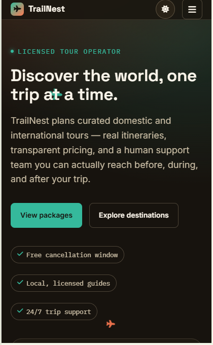
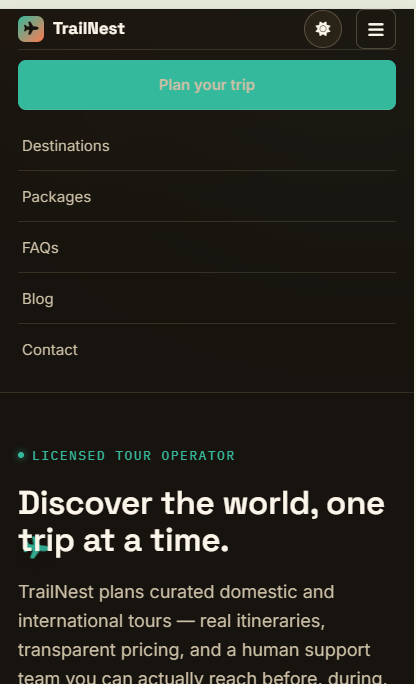
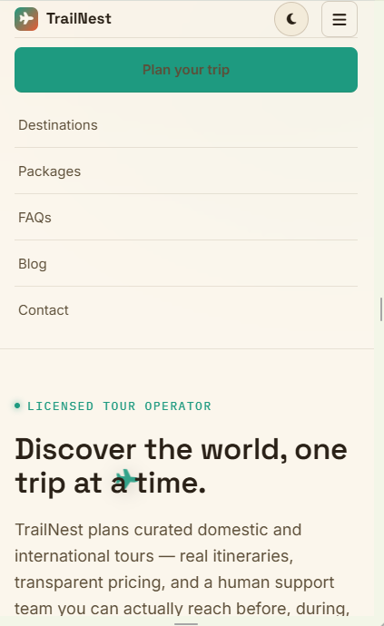
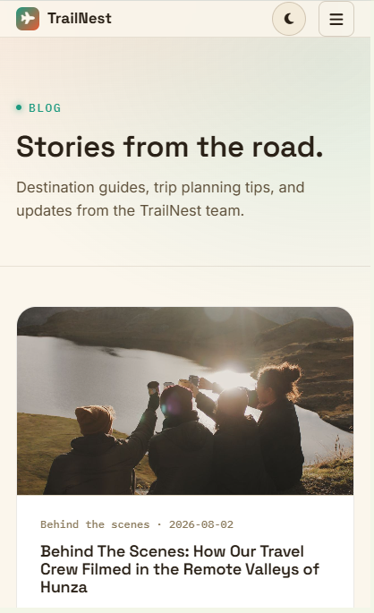
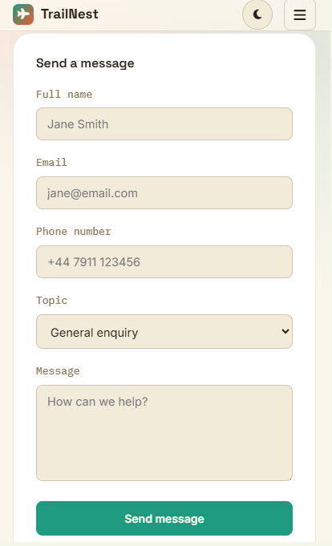
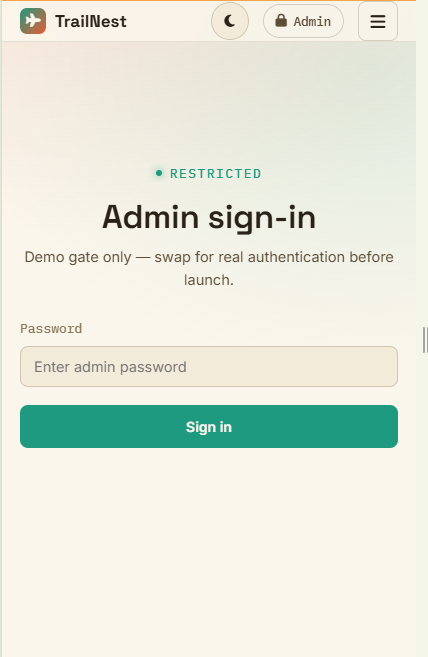
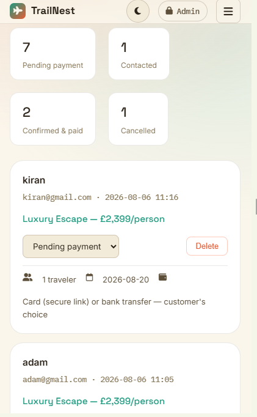
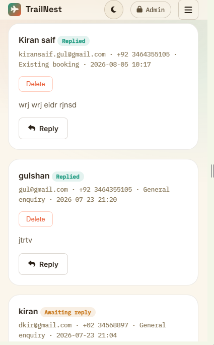

---

## ✨ Features

**Public site**
- Home page: animated hero (flying plane), real featured-trip image, stats bar, live "trip availability" status panel, feature grid, DIY-vs-package comparison table, auto-scrolling "what's included" perks marquee, package pricing, click-to-expand FAQ accordion
- Blog: listing page with a **"Read more" link that opens a dedicated post page** (`post.html?id=...`) — not a modal. The blog starts empty until you publish your first post from the admin panel.
- Contact page: address/email/phone, a validated contact form, mini package summary
- **Package booking flow** (3 steps): pick a tour + contact details → "Request sent" confirmation → trip details (travelers, date) and payment info (secure card link explained, plus real bank transfer details shown directly) → final confirmation. No raw card number/CVV fields are collected anywhere on the site — that needs a real, PCI-compliant payment processor (Stripe, PayPal, etc.), not a static site.
- **Light/dark mode toggle** (sun/moon icon in the nav), preference remembered on return visits
- Custom favicon and logo (airplane mark)
- Fully responsive, including a hamburger menu on mobile

**Admin panel** (password-gated demo)
- `admin.html` — publish/edit/delete blog posts with a rich text editor (bold, italic, lists, image URL insert, table insert). Nav links to Contact messages, Booking requests, and Home.
- `admin-contact.html` — view contact form submissions, reply via your own email app (mailto), or copy the reply text to paste into webmail. Nav links to Blog admin, Booking requests, and Home.
- `admin-bookings.html` — view package booking requests (traveler count, travel date, payment method, notes), update status (Pending payment → Contacted → Confirmed & paid → Cancelled). Nav links to Blog admin, Contact messages, and Home.

**Validation**
- Email format is checked strictly, both on blur (leaving the field) and on submit, then verified against a real DNS lookup (Google's public DNS-over-HTTPS API) to confirm the domain can actually receive mail. Invalid emails show "Enter a valid email address" and the form will not submit.
- Phone numbers are checked for plausible format and rejected if obviously fake (e.g. all repeated digits)

---

## 🗂 File structure

```
trailnest-site/
├── index.html          Home page
├── blog.html            Blog listing (Read more → post.html)
├── post.html             Single blog post page (reads ?id= from URL)
├── contact.html          Contact form + info
├── admin.html            Blog post admin
├── admin-contact.html    Contact message admin (reply via email)
├── admin-bookings.html   Booking request admin
├── styles.css            Shared design system (colors, type, components, light/dark theme)
├── theme.js               Light/dark mode toggle + file:// warning banner
├── blog-data.js           Blog post storage (localStorage) — no seed posts
├── site-data.js           Contact messages, booking requests, validation helpers
├── favicon.svg            Site icon (airplane mark)
├── screenshots/            Images used in this README
└── README.md              This file
```

All pages reference each other by relative path and share `styles.css`/`theme.js`, so **keep every file in the same folder**.

---

## 🚀 Running it

```bash
# Python
python3 -m http.server 8000
# or Node
npx serve .
```

Then visit `http://localhost:8000`. See the warning at the top of this README for why this matters more than it looks.

---

## 📝 Adding your first blog post

The blog is intentionally empty out of the box. To add a post:

1. Go to `admin.html` and sign in (see below).
2. Fill in the image URL, title, category, and excerpt.
3. Use the toolbar to write the full post — bold/italic text, bullet lists, images, and tables are all supported.
4. Click **Publish post**. It'll immediately appear on `blog.html`, and clicking "Read more" opens it on its own page via `post.html?id=...`.

---

## 💳 How the booking flow works

1. **Step 1** — Traveler picks a tour (or arrives with one pre-selected from a package card), enters name + email. Email is validated live.
2. **Step 2** — "Request sent" confirmation, showing which tour was requested.
3. **Step 3** — Traveler count, preferred date, and payment info: a "Pay by card" panel explaining a secure checkout link will be emailed, and a "Pay by bank transfer" panel with real account details shown directly (placeholder values — replace with your actual business bank details).
4. **Step 4** — Final confirmation. The full request (contact info, trip details, chosen approach) is saved and appears in `admin-bookings.html`.

No card number, expiry, or CVV fields exist anywhere in this flow, by design — collecting that without a real, PCI-compliant payment processor behind it would be a serious security risk to real customers.

---

## 🔐 Admin access

- URL: `admin.html`, `admin-contact.html`, `admin-bookings.html`
- Demo password: `admin123` (set in each file — search for `DEMO_PASSWORD`)

**This is a demo-only gate.** The password is visible in plain text in the page source and there's no real session or server-side check. Replace it with real authentication before this goes anywhere near real customers.

---

## 🌗 Light / dark mode

Click the sun/moon icon in the nav bar on any page. The choice is saved (`localStorage`) and applied instantly on future visits, with no flash of the wrong theme on load. Colors for both modes are defined once, at the top of `styles.css`, under `:root` (dark) and `[data-theme="light"]` (light) — edit those variables to adjust the palette.

If the toggle doesn't seem to "stick" between pages, that's the same `file://` storage issue described at the top of this README — run a local server.

---

## ⚠️ Known limitations (read before going live)

This is a front-end-only build. A few things are intentionally *not* production-ready yet:

| Area | Current state | What's needed for production |
|---|---|---|
| **Data storage** | Browser `localStorage` (per-device, and per-origin — see the `file://` warning above) | A real database + backend API |
| **Payments** | Card payment explains a secure link is coming by email; bank transfer shows placeholder account details | A real payment processor (Stripe, PayPal, etc.) with a proper backend, and your actual bank account details |
| **Email replies** | Opens your device's default email app via `mailto:` | A transactional email service (Resend, SendGrid, etc.) for one-click automatic sending |
| **Email/phone verification** | Format check + real domain/MX lookup (email only) | True verification needs a confirmation-email link or SMS OTP — both need a backend |
| **Admin login** | Hardcoded demo password | Real authentication (hashed passwords, sessions, or SSO) |

---

## 🎨 Customizing

- **Brand name/logo**: search for `TrailNest` across all files and replace. The logo icon is a Font Awesome plane (`fa-plane`) inside `.logo-mark` — swap the icon class for a different one if you like.
- **Favicon**: edit `favicon.svg` directly (it's a simple two-color SVG) or replace it with your own icon file.
- **Colors/fonts**: edit the CSS variables at the top of `styles.css` (`:root` for dark mode, `[data-theme="light"]` for light mode).
- **Contact details**: edit the address/email/phone block in `contact.html`.
- **Bank transfer details**: edit the placeholder account info in the Step 3 payment panel in `index.html` (search for `bd-name`, `bd-bank`, `bd-acct`, `bd-iban`).
- **Packages/pricing**: edit the package cards and the tour dropdown in `index.html` (`#packages` section) and `contact.html`.
- **Featured trip image**: replace the placeholder image URL in the hero section of `index.html` with a real photo.
- **Blog post images**: added per-post from the admin panel's "Image URL" field — paste any real image URL when you publish.

---

## 🧱 Tech stack

Plain HTML/CSS/JS — no framework, no build tools. Fonts via Google Fonts (Space Grotesk, Inter, IBM Plex Mono), icons via Font Awesome (CDN).
